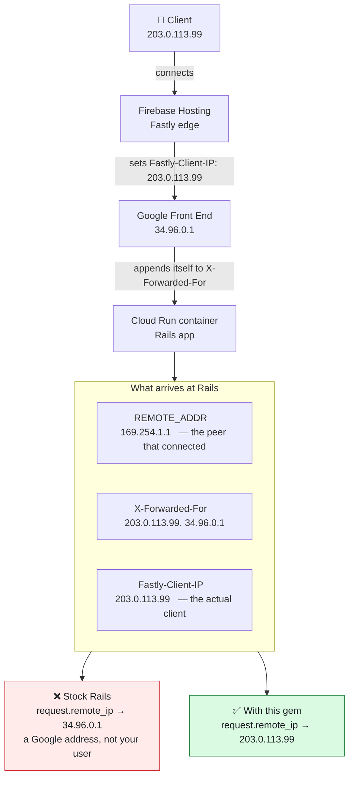

# FirebaseHostingClientIp

[](https://badge.fury.io/rb/firebase_hosting_client_ip)

Rails middleware that makes `request.remote_ip` return the real client IP when your application is deployed behind Firebase Hosting.

## Problem

Firebase Hosting fronts your application with Fastly (undocumented, not configurable — every Firebase Hosting site gets it). When the origin is Cloud Run, nothing your application sees at the socket belongs to the client: every hop in front of it is Google infrastructure, and each one looks like a legitimate caller.



Rails resolves `remote_ip` by walking `X-Forwarded-For` right-to-left, discarding entries it recognizes as *trusted* proxies. A Google front-end address is public and appears in no trusted-proxy list, so the walk stops there and reports it as the client. Every request then looks like it came from the same handful of Google addresses — which quietly breaks rate limiting, IP allowlists, geolocation, and audit trails.

Fastly sets `Fastly-Client-IP` to the end user's address. In this architecture it is the only trustworthy source, and this gem's entire job is to make Rails use it.

## What it does

One thing:

> If `Fastly-Client-IP` is present and contains a valid IP address, `request.remote_ip` returns it. Otherwise the gem gets out of the way.

- **`REMOTE_ADDR` is never modified.** `request.ip` keeps reporting the actual peer address; `request.remote_ip` reports the client. They describe different layers, and conflating them was the design mistake in 0.x.
- **`X-Forwarded-For` is never consulted.** It cannot distinguish the client from Google's infrastructure, and it is attacker-controlled if your service can be reached directly.
- **IP values are validated, not rewritten.** The header's own spelling is passed through — an expanded IPv6 address is not silently compressed.

The middleware is inserted automatically after `ActionDispatch::RemoteIp`, where it replaces the value Rails computed. No application changes are required, and anything reading `request.remote_ip` — your code, Rack::Attack, audit logging, rate limiters — picks it up.

## Installation

```ruby
gem "firebase_hosting_client_ip"
```

Requires Ruby >= 3.2 and Rails >= 7.0.

## Usage

```ruby
class ApplicationController < ActionController::Base
  def index
    Rails.logger.info "Request from: #{request.remote_ip}"
  end
end
```

### Configuration

There is one option, and it controls a single decision: when there is no trustworthy Fastly IP, does Rails decide, or does your application get a value it can recognize as "unknown"?

```ruby
# config/initializers/firebase_hosting_client_ip.rb
FirebaseHostingClientIp.configure do |config|
  # :passthrough (default) - leave Rails' own value alone. Behind Cloud Run
  #   that is typically a Google front-end address, not your client.
  # A String - written to request.remote_ip verbatim, so the application can
  #   detect it and act accordingly (e.g. fail closed on IP-gated actions).
  config.missing_header_fallback = "0.0.0.0"
end
```

Any String is accepted, including `""`; the gem imposes no meaning on the sentinel — that is your application's decision. Non-String values other than `:passthrough` raise `ArgumentError`, because `request.remote_ip` coerces with `to_s` and a `nil` would silently fall back to Rack's own calculation.

If you do anything security-adjacent with `request.remote_ip` — allowlisting, rate limiting, audit trails — prefer a sentinel. Passthrough means a Google address flows into that logic looking exactly like a real client.

### A header is considered valid only if it is a bare host address

These are all treated as if the header were missing:

| Value | Why |
|---|---|
| `""`, `"   "` | empty |
| `"not-an-ip"` | unparseable |
| `"192.0.2.1/24"`, `"2001:db8::1/64"` | a range is not a client address |
| `"[2001:db8::42]"` | bracketed form |
| `"2001:db8::42%eth0"` | zone identifier |

`IPAddr.new` accepts several of these, so the gem rejects them explicitly rather than passing them to Rails, where they would raise in any consumer that parses the value.

## Security

**This middleware trusts an HTTP header, and that header is not cryptographically protected.**

Two separate attacks matter, and blocking one does not block the other:

1. **Direct requests to the origin.** Anyone who can reach your Cloud Run service without going through Firebase Hosting can set `Fastly-Client-IP` to anything. Restrict ingress (internal + load balancer only) so this is not possible.
2. **Requests through Firebase Hosting carrying a forged header.** Whether the CDN overwrites a client-supplied `Fastly-Client-IP` or forwards it unchanged is not documented by Firebase, and Fastly's own behavior for this header depends on edge configuration you do not control. **Locking down origin ingress does not protect you here** — the forged header travels the trusted path.

Verify the second one against your own deployment before relying on this for anything protective:

```bash
curl -H 'Fastly-Client-IP: 192.0.2.123' https://your-app.example.com/some-endpoint
```

Then check what `request.remote_ip` recorded. If it is `192.0.2.123`, the header is client-spoofable through the CDN on your setup.

### Choose based on what you use the IP for

| Use | Spoofable header acceptable? |
|---|---|
| Logging, analytics, geolocation, personalization | **Yes.** A wrong IP in a subset of requests is better than a Google address in all of them. |
| IP allowlists, rate limiting, fraud signals, audit records used as evidence | **No.** An attacker chooses the value, which means they choose the allowlist entry they match or the bucket they exhaust. |

The gem reports the best available answer; it cannot make that answer trustworthy. `missing_header_fallback` does not help here either — a forged header is *present and valid*, so it never reaches the fallback path.

## What this gem does not cover

**`request.ip`** is Rack-level and derives from `REMOTE_ADDR`, which this gem deliberately leaves intact. Anything that must see the client IP should read `request.remote_ip`. For a Rack-level consumer that only has `env`:

```ruby
env["action_dispatch.remote_ip"].to_s
```

**IPv6.** Fastly reports the client's real address, which is frequently IPv6. The gem passes it through untouched. If your application matches against IPv4-only data — allowlists, geo databases, existing audit records — deciding what to do about that is application policy, not something a middleware should guess at.

## Alternative: teach Rails to skip Google's ranges

You may not need this gem. Rails already knows how to walk `X-Forwarded-For` — it just doesn't recognize Google's front end as a proxy. Tell it, and it finds the client on its own:

```ruby
# config/application.rb
config.action_dispatch.trusted_proxies =
  ActionDispatch::RemoteIp::TRUSTED_PROXIES + google_ranges
```

Google publishes the ranges as machine-readable JSON, refreshed daily:

| File | Contents |
|---|---|
| `https://www.gstatic.com/ipranges/goog.json` | all Google ranges (~145 prefixes) |
| `https://www.gstatic.com/ipranges/cloud.json` | Google Cloud only (~1100 prefixes) |

Each entry is an `ipv4Prefix` or `ipv6Prefix` you can map to `IPAddr`. Verified: with `X-Forwarded-For: 203.0.113.99, 34.96.0.1`, stock Rails returns `34.96.0.1`; adding the front-end range to `trusted_proxies` makes it return `203.0.113.99`.

Three things to weigh before choosing it:

- **It assumes the client is in `X-Forwarded-For` at all.** Whether Firebase Hosting preserves the original client there — rather than only the hop it received — is undocumented. Test your own deployment before depending on it; if the client is absent from the header, no amount of range filtering recovers it.
- **Trust the narrowest range you can.** Trusting all of `cloud.json` means trusting every Google Cloud customer. Anyone with a GCP VM can then send a request with a forged `X-Forwarded-For`, have their own (trusted) address appended behind it, and be attributed the value they chose. Trusting only the specific front-end ranges avoids that.
- **The ranges move.** Vendoring the list means it goes stale; fetching it at boot makes startup depend on a network call. Either is a maintenance cost this gem does not have.

The trade is roughly: this gem reads one header and is done, but depends on Fastly setting it; the `trusted_proxies` route uses only stock Rails, but depends on the client surviving in `X-Forwarded-For` and on you keeping a range list current.

### Using both

They compose, and each covers the other's failure mode. Configure `trusted_proxies` *and* install the gem, leaving `missing_header_fallback` at `:passthrough`:

```
Fastly-Client-IP present : 198.51.100.7   ← the gem answers
Fastly-Client-IP absent  : 203.0.113.99   ← Rails finds the client via ranges
```

The fallback path stops meaning "you get a Google address" and starts meaning "you get the client according to `X-Forwarded-For`". This is the strongest configuration for accuracy, and it costs one `config.action_dispatch.trusted_proxies` line. Note it only works with `:passthrough` — a sentinel would override the improved fallback.

### Which wins, and when that is the wrong choice

The gem takes precedence: it runs after `ActionDispatch::RemoteIp` and replaces whatever Rails computed. That is right for accuracy — a header set by the hop that actually saw the client beats inferring the client by eliminating known infrastructure from a list that changes daily.

**It is the wrong precedence if you are defending against forgery.** The two approaches do not degrade the same way under attack. Given a request that forges *both* headers:

```
X-Forwarded-For: 1.2.3.4, 203.0.113.99, 151.101.1.1, 34.96.0.1
Fastly-Client-IP: 1.2.3.4

trusted_proxies only : 203.0.113.99   ← the real client
with this gem        : 1.2.3.4        ← the attacker's choice
```

`X-Forwarded-For` resists this because every real proxy appends the peer it saw, so the true client always lands to the *right* of anything the client invented, and Rails takes the right-most untrusted entry. A forged prefix is simply skipped. `Fastly-Client-IP` carries no such structure: it is one value, and if the CDN does not overwrite a client-supplied one, it is whatever the client said.

So installing this gem can *reduce* spoof resistance compared with a correctly configured `trusted_proxies` setup. If you use the client IP for access control rather than observability, prefer `trusted_proxies` — trusting both the CDN and Google hops, using Fastly's published list at `https://api.fastly.com/public-ip-list` alongside Google's — and consider not installing this gem at all. The two precedence orders are already available to you: install it, and the header wins; don't, and the `X-Forwarded-For` walk wins. That is why there is no option to invert it.

All of this assumes the client actually survives in `X-Forwarded-For` behind Firebase Hosting, which is undocumented. The `curl` in the [Security](#security) section answers that and the spoofing question in the same request — run it before choosing.

### Why the gem does not do the range filtering itself

Because Rails already does it, and the data is not the gem's to ship. Google republishes those prefixes daily; a gem released monthly cannot track them, so it would either vendor a list that goes stale — silently returning a Google address again, exactly the bug this gem exists to fix — or fetch at boot and make your application's startup depend on a network call. `trusted_proxies` is a first-class Rails setting and the right home for it.

## Upgrading from 0.x

Breaking changes in 1.0:

- **`REMOTE_ADDR` is no longer overwritten.** If you relied on reading the client IP from `REMOTE_ADDR` or `request.ip`, switch to `request.remote_ip`.
- **The `X-Forwarded-For` fallback is gone.** When `Fastly-Client-IP` is absent, 0.x returned the left-most `X-Forwarded-For` entry — a value that is either Google's infrastructure or attacker-supplied. 1.0 returns Rails' own value, or your configured sentinel.

## Development

```bash
bin/setup
bundle exec rspec
bundle exec rubocop
bundle exec rake        # spec + rubocop
```

## Contributing

Bug reports and pull requests are welcome at https://github.com/quintsys/firebase_hosting_client_ip. Contributors are expected to adhere to the [code of conduct](https://github.com/quintsys/firebase_hosting_client_ip/blob/master/CODE_OF_CONDUCT.md).

## License

MIT. See [LICENSE.txt](LICENSE.txt).
