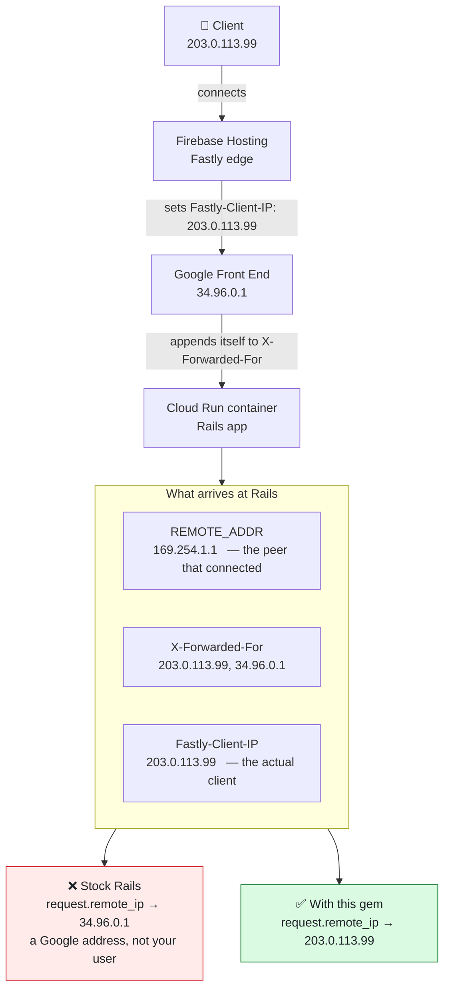

# FirebaseHostingClientIp

[](https://badge.fury.io/rb/firebase_hosting_client_ip)

Rails middleware that makes `request.remote_ip` return the real client IP when your application is deployed behind Firebase Hosting.

## Problem

Firebase Hosting fronts your application with Fastly (undocumented, not configurable — every Firebase Hosting site gets it). When the origin is Cloud Run, nothing your application sees at the socket belongs to the client: every hop in front of it is Google infrastructure, and each one looks like a legitimate caller.



Rails resolves `remote_ip` by walking `X-Forwarded-For` right-to-left, discarding entries it recognizes as *trusted* proxies. A Google front-end address is public and appears in no trusted-proxy list, so the walk stops there and reports it as the client. Every request then looks like it came from the same handful of Google addresses — which quietly breaks rate limiting, IP allowlists, geolocation, and audit trails.

Fastly sets `Fastly-Client-IP` to the end user's address. In this architecture it is the only trustworthy source, and this gem's entire job is to make Rails use it.

## What it does

One thing:

> If `Fastly-Client-IP` is present and contains a valid IP address, `request.remote_ip` returns it. Otherwise the gem gets out of the way.

- **`REMOTE_ADDR` is never modified.** `request.ip` keeps reporting the actual peer address; `request.remote_ip` reports the client. They describe different layers, and conflating them was the design mistake in 0.x.
- **`X-Forwarded-For` is never consulted.** It cannot distinguish the client from Google's infrastructure, and it is attacker-controlled if your service can be reached directly.
- **IP values are validated, not rewritten.** The header's own spelling is passed through — an expanded IPv6 address is not silently compressed.

The middleware is inserted automatically after `ActionDispatch::RemoteIp`, where it replaces the value Rails computed. No application changes are required, and anything reading `request.remote_ip` — your code, Rack::Attack, audit logging, rate limiters — picks it up.

## Installation

```ruby
gem "firebase_hosting_client_ip"
```

Requires Ruby >= 3.2 and Rails >= 7.0.

## Usage

```ruby
class ApplicationController < ActionController::Base
  def index
    Rails.logger.info "Request from: #{request.remote_ip}"
  end
end
```

### Configuration

There is one option, and it controls a single decision: when there is no trustworthy Fastly IP, does Rails decide, or does your application get a value it can recognize as "unknown"?

```ruby
# config/initializers/firebase_hosting_client_ip.rb
FirebaseHostingClientIp.configure do |config|
  # :passthrough (default) - leave Rails' own value alone. Behind Cloud Run
  #   that is typically a Google front-end address, not your client.
  # A String - written to request.remote_ip verbatim, so the application can
  #   detect it and act accordingly (e.g. fail closed on IP-gated actions).
  config.missing_header_fallback = "0.0.0.0"
end
```

Any String is accepted, including `""`; the gem imposes no meaning on the sentinel — that is your application's decision. Non-String values other than `:passthrough` raise `ArgumentError`, because `request.remote_ip` coerces with `to_s` and a `nil` would silently fall back to Rack's own calculation.

If you do anything security-adjacent with `request.remote_ip` — allowlisting, rate limiting, audit trails — prefer a sentinel. Passthrough means a Google address flows into that logic looking exactly like a real client.

### A header is considered valid only if it is a bare host address

These are all treated as if the header were missing:

| Value | Why |
|---|---|
| `""`, `"   "` | empty |
| `"not-an-ip"` | unparseable |
| `"192.0.2.1/24"`, `"2001:db8::1/64"` | a range is not a client address |
| `"[2001:db8::42]"` | bracketed form |
| `"2001:db8::42%eth0"` | zone identifier |

`IPAddr.new` accepts several of these, so the gem rejects them explicitly rather than passing them to Rails, where they would raise in any consumer that parses the value.

## Security

**This middleware trusts an HTTP header.** `Fastly-Client-IP` can be forged by anyone who can reach your application directly.

It is safe only when:

- your application sits behind Firebase Hosting, and
- direct access to the origin is blocked (e.g. Cloud Run ingress restricted to internal + load balancer traffic).

Do not use it if your origin is reachable from the internet, or if you need strict guarantees about IP authenticity.

## What this gem does not cover

**`request.ip`** is Rack-level and derives from `REMOTE_ADDR`, which this gem deliberately leaves intact. Anything that must see the client IP should read `request.remote_ip`. For a Rack-level consumer that only has `env`:

```ruby
env["action_dispatch.remote_ip"].to_s
```

**IPv6.** Fastly reports the client's real address, which is frequently IPv6. The gem passes it through untouched. If your application matches against IPv4-only data — allowlists, geo databases, existing audit records — deciding what to do about that is application policy, not something a middleware should guess at.

## Upgrading from 0.x

Breaking changes in 1.0:

- **`REMOTE_ADDR` is no longer overwritten.** If you relied on reading the client IP from `REMOTE_ADDR` or `request.ip`, switch to `request.remote_ip`.
- **The `X-Forwarded-For` fallback is gone.** When `Fastly-Client-IP` is absent, 0.x returned the left-most `X-Forwarded-For` entry — a value that is either Google's infrastructure or attacker-supplied. 1.0 returns Rails' own value, or your configured sentinel.

## Development

```bash
bin/setup
bundle exec rspec
bundle exec rubocop
bundle exec rake        # spec + rubocop
```

## Contributing

Bug reports and pull requests are welcome at https://github.com/quintsys/firebase_hosting_client_ip. Contributors are expected to adhere to the [code of conduct](https://github.com/quintsys/firebase_hosting_client_ip/blob/master/CODE_OF_CONDUCT.md).

## License

MIT. See [LICENSE.txt](LICENSE.txt).
